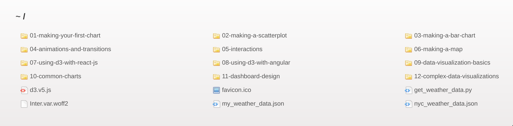

# Fullstack D3 and Data Visualization

This is the full code that goes along with [**Fullstack D3 and Data Visualization**](https://fullstack.io/fullstack-d3).
We're so excited that you're interested in learning d3.js and data visualization with us!

To run these examples, either read the Introduction and the first chapter of the book, or follow the instructions below.

## Getting Started

You'll need a static file server to circumvent CORS limitations. Here are two options that will work -- feel free to use either, or another one that you're comfortable with.

a. **node.js**

_I would recommend using this method because it has **live reload** built in, meaning that our page will update when we save our changes. No page refresh necessary!_

If you don't have **node.js** installed, take a minute to install it ([instructions here](https://docs.npmjs.com/downloading-and-installing-node-js-and-npm)). You can check whether or not **node.js** is already installed by using the `node -v` command in your terminal — if it responds with a version number, you're good to go! **node.js** should also come with **npm**, which is short for _Node Package Manager_

Once **node.js** and **npm** are installed, run the following command in your terminal.

```shell
npm install -g live-server
```

This will install [**live-server**](https://github.com/tapio/live-server), a simple static server that has live reload built-in. To start your server, run `live-server` in the root `/code` folder and it will even open a new browser window for you.

b. **python**

If you have **python** (version 3) installed already, you can use the Python 3 http server instead. Start it up in the root `/code` folder with by running the command `python -m http.server 8080` in your terminal.

The particular server doesn't matter — the key idea is that if you want to load a file from JavaScript, you need to do it from a webserver, and these tools are an easy solution for a development environment. Make sure that you are in the root `/code` folder when you start either server.

Now we should have a server on port 8080. Load [localhost:8080](http://localhost:8080) in your web browser and you'll see a directory of code for each chapter, which looks something like this:



Click through the folders to find the example you're working on.

For all of our code examples, there will be a finished version in a sibling `/completed` folder.

## Getting help

The code in this book has been vigorously tested to ensure that it works in all modern environments. But if you run into any part that is confusing, or if you get stuck anywhere, please reach out!

Send an email to [us@fullstack.io](mailto:us@fullstack.io) detailing the issue and we'll get back to you as soon as possible.

## License

This project is licensed under the MIT License - see the [LICENSE.md](LICENSE.md) file for details
